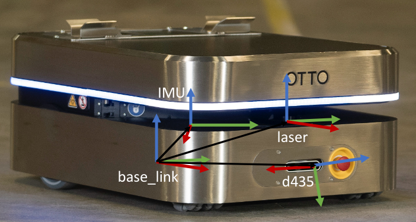
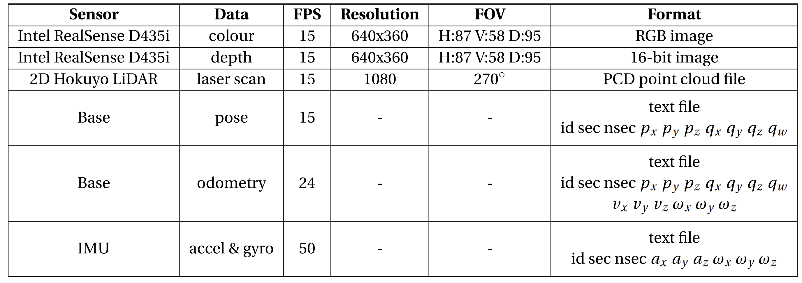

# ChangingWarehouseDataset

## Description
This repository contains the released dataset discussed in **POCD: Probabilistic Object-Level Change Detection and Volumetric Mapping in Semi-Static Scenes**, in _2022 Robotics: Science and Systems (RSS)_, 2022. [[Paper](Link)]. The purpose of this dataset is to evaluate the map mainteneance capabilities in a warehouse environment undergoing incremental changes. The novel dataset taken in the Clearpath Robotics warehouse is located [here](https://drive.google.com/drive/folders/12-h2OPmlmxLk0Y9C3Hr5glkalUp66oEJ?usp=sharing). 

This dataset contains 18 trajectories that can be merged using the provided script to create a changing environment.

## Citing

When using **POCD** or the dataset in your research, please cite the following publication:

Jingxing Qian, Veronica Chatrath, Jun Yang, James Servos, Angela Schoellig, and Steven L. Waslander, **POCD: Probabilistic Object-Level Change Detection and Volumetric Mapping in Semi-Static Scenes**, in _2022 Robotics: Science and Systems (RSS)_, 2022. [[Paper](Link)] 

```bibtex
@INPROCEEDINGS{QianChatrathPOCD,
  author={Qian, Jingxing and Chatrath, Veronica and Yang, Jun and Servos, James and Schoellig, Angela and Waslander, Steven L.},
  booktitle={2022 Robotics: Science and Systems (RSS)}, 
  title={{POCD: Probabilistic Object-Level Change Detection and Volumetric Mapping in Semi-Static Scenes}}, 
  year={2022},
  volume={},
  number={},
  pages={},
  doi={}}
```

## Data directory structure
The configuration changes can be seen in the following .

```
WarehouseSequences
|
|----Baseline configuration
|       +--- rgb                      # 0000.png - xxxx.png      
|       +--- depth                    # 0000.png - xxxx.png
|       +--- segmentation             # 0000.png - xxxx.png    
|       +--- laser scans              # 0000.pcd - xxxx.pcd 
|       --- poses.txt 
|       --- imu.txt 
|       --- odom.txt
|
|---- 1- Box Shifts and Rotations  
|
|-------Sequence 1-1
|       +--- rgb                      # 0000.png - xxxx.png      
|       +--- depth                    # 0000.png - xxxx.png
|       +--- segmentation             # 0000.png - xxxx.png   
|       +--- laser scans              # 0000.pcd - xxxx.pcd
|       --- poses.txt 
|       --- imu.txt 
|       --- odom.txt
|
|-------Sequence 1-X
|
|---- 2- Removing Boxes
|
|-------Sequence 2-1
|       +--- rgb                      # 0000.png - xxxx.png      
|       +--- depth                    # 0000.png - xxxx.png
|       +--- segmentation             # 0000.png - xxxx.png  
|       +--- laser scans              # 0000.pcd - xxxx.pcd
|       --- poses.txt 
|       --- imu.txt 
|       --- odom.txt
|
|-------Sequence 2-X
|
|---- X: Configuration Change
```

## Robot and sensors
The dataset was collected on the [OTTO 100 Autonomous Mobile Robot](https://ottomotors.com/100\#stats), remote controlled by a human operator at walking speed. We record sensor measurements from an Intel RealSense D435i RGB-D camera, a wheel encoder, an IMU unit, and a Hokuyo UAM501 2D laser scanner, all rigidly mounted on the platform. The following figure shows the robot platform and the sensor frames, and the following table lists the specifications and formats of the sensor measurements.





## How to merge trajectories into ROS bags

1) Clone this repository
2) Ensure the Scenario folders that contain the dataset are in the repository folder
3) Run: ```python3 utils/create_rosbag_from_trajs.py <traj 1> <traj_2> ... <traj_n>``` \
For example: ```python3 utils/create_rosbag_from_trajs.py 1-2 3-1```

The scripy relies on ```pypcd``` to proces the laser scans. If you are using Python3, please use the following [version](https://github.com/dimatura/pypcd/pull/35).

## Segmentation Mask Loopup table

| Semantic Class     |  uint16 Class ID |   Colour | RGB     |
|:----      | :----:   |   :----:   |          :----:|
| Background      | 0  |black       | [0,0,0]   |
| Driveable Ground   |1  | white       | [255,255,255]     |
| Ceiling  | 2  |baby blue        | [0,191,255]      |
| Wall/Fence/Pillar   | 3  |bright green       | [0,255,0]      |
| Fixed Machinery | 4  |hot pink        | [255,0,102]      |
| Rack/Shelf  | 5  |purple       | [153,0,204]     |
| Text Region Feature   | 6  |dark blue       | [51, 51, 204]    |
| Miscellaneous Static Feature  |7  | teal        | [0, 153, 153]     |
| Goods Materials   |8  | baby pink        | [255, 204, 255]    |
| Cart/Pallet Jack  |9  |orange        |[255, 153, 0]      |
| Pylons   | 10  |yellow        | [255, 255, 0]     |
| Miscellaneous Non-Static Feature   | 11  |bright red        | [255, 0, 0]       |
| Person   | 12  |baby purple        | [204, 102, 255]      |
| Forklift/Truck   |13  |watermelon         | [255, 77, 77]      |
| Miscellaneous Dynamic Feature  | 14  |dark green       | [0, 153, 51]     |
| Ego Vehicle  | 15  |grey        | [191, 191, 191]      |

## Dataset FAQ
Q) Is the data synchronized? \
A) Yes. The data from the RealSense sensor is synchronized with information from the other sensors. 

Q) Where are the sensor intrinsics and extrinsics? \
A) This information is provided in the data Google Drive link in the text file. Sensor extrinsics are provided in the ROS bags under the tf\_static topic. This information is the same for all trajectories. 

Q) What is the unit of the depth values? \
A) The depth images from RealSense D435i are scaled by a factor of 1000. The uint16 values can be converted into float values and multiplied by 0.001 to get depth values in meters. 
