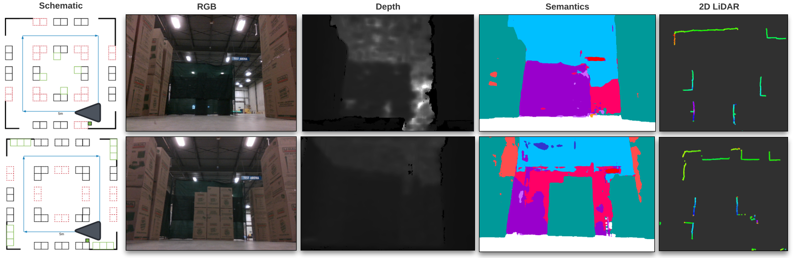

# The Toronto Warehouse Incremental Change Dataset

## Description
This repository contains the released dataset discussed in **POCD: Probabilistic Object-Level Change Detection and Volumetric Mapping in Semi-Static Scenes**. [[Paper](Link)]. The purpose of this dataset is to evaluate the map mainteneance capabilities in a warehouse environment undergoing incremental changes. This dataset is collected in a [Clearpath Robotics](https://clearpathrobotics.com/) facility.

In the image below is an example of two frames captures by the robot at the AprilTag in two scenarios (Scenario_2-2 and Scenario_4-1). Changes include 3 stacks of boxes added in front of the fence, and an additional box wall to the right of the fence.


## Download dataset
The novel dataset taken in the Clearpath Robotics warehouse is located [here](https://drive.google.com/drive/folders/12-h2OPmlmxLk0Y9C3Hr5glkalUp66oEJ?usp=sharing). This dataset contains 18 trajectories that can be merged using the provided script to create a changing environment.

## Data directory structure
The configuration changes can be seen in the following .

Each scenario configuration follows the same folder structure, as seen below. Please see the next section on further details regarding each sensor. 

```
WarehouseSequences
|
|----Baseline configuration
|       +--- rgb                      # 0000.png - xxxx.png      
|       +--- depth                    # 0000.png - xxxx.png
|       +--- segmentation             # 0000.png - xxxx.png    
|       +--- laser scans              # 0000.pcd - xxxx.pcd 
|       --- poses.txt 
|       --- imu.txt 
|       --- odom.txt
|
|---- 1- Box Shifts and Rotations  
|
|-------Sequence 1-1
|       +--- rgb                      # 0000.png - xxxx.png      
|       +--- depth                    # 0000.png - xxxx.png
|       +--- segmentation             # 0000.png - xxxx.png   
|       +--- laser scans              # 0000.pcd - xxxx.pcd
|       --- poses.txt 
|       --- imu.txt 
|       --- odom.txt
|
|-------Sequence 1-X
|
|---- 2- Removing Boxes
|
|-------Sequence 2-1
|       +--- rgb                      # 0000.png - xxxx.png      
|       +--- depth                    # 0000.png - xxxx.png
|       +--- segmentation             # 0000.png - xxxx.png  
|       +--- laser scans              # 0000.pcd - xxxx.pcd
|       --- poses.txt 
|       --- imu.txt 
|       --- odom.txt
|
|-------Sequence 2-X
|
|---- X: Configuration Change
```

## Robot and sensors
The dataset was collected on the [OTTO 100 Autonomous Mobile Robot](https://ottomotors.com/100\#stats), remote controlled by a human operator at walking speed. We record sensor measurements from an Intel RealSense D435i RGB-D camera, a wheel encoder, an IMU unit, and a Hokuyo UAM501 2D laser scanner, all rigidly mounted on the platform. The following figure shows the robot platform and the sensor frames, and the following table lists the specifications and formats of the sensor measurements.


The dataset provides 18 trajectories in 4 scenarios, including the baseline setup. Each trajectory contains the robot traversing through a static  configuration of the environment, starting and finishing at the fixed April-Tag. Users can stitch the trajectories together with the provided script to create routes with structural changes in the scene. A high-level overview of the scenarios and trajectories is listed in the table below. 


## How to merge trajectories into ROS bags

1) Clone this repository
2) Ensure the Scenario folders that contain the dataset are in the repository folder
3) Run: ```python3 utils/create_rosbag_from_trajs.py <traj 1> <traj_2> ... <traj_n>``` \
For example: ```python3 utils/create_rosbag_from_trajs.py 1-2 3-1```

The script relies on ```pypcd``` to proces the laser scans. If you are using Python3, please use the following [version](https://github.com/dimatura/pypcd/pull/35).

## Ground-truth Segmentation for Fine-tuning
A proprietary model was trained to produce the semantic labels for the dataset. Unfortunately, the full training data cannot be released. However, we release a subset of this data such that users can fine-tune their models, if needed. Within the [main folder](https://drive.google.com/file/d/1ovm4ycVrQfpuseI2Kc8TofS-LI0Nly_I/view?usp=sharing), there are 79 folders with unique ID's. Within each folder, there are 3 sets of images, each within its own sub-folder. Each image folder contains an image of the individual semantic mask, the source RGB image, the combined semantic mask image, the combined semantic indexed image, and an annotation ```.json file```. For training purposes, the combined indexed image should be used ```combined_indexedImage.png```. Each pixel holds the class ID of the semantic class corresponding to the table below. The provided ROSbags of the dataset contain colourized masks that correspond to the Class ID column in the table below. 

| Semantic Class     |  uint16 Class ID |   Colour | RGB     |
|:----      | :----:   |   :----:   |          :----:|
| Background      | 0  |black       | [0,0,0]   |
| Driveable Ground   |1  | white       | [255,255,255]     |
| Ceiling  | 2  |baby blue        | [0,191,255]      |
| Wall/Fence/Pillar   | 3  |bright green       | [0,255,0]      |
| Fixed Machinery | 4  |hot pink        | [255,0,102]      |
| Rack/Shelf  | 5  |purple       | [153,0,204]     |
| Text Region Feature   | 6  |dark blue       | [51, 51, 204]    |
| Miscellaneous Static Feature  |7  | teal        | [0, 153, 153]     |
| Goods Materials   |8  | baby pink        | [255, 204, 255]    |
| Cart/Pallet Jack  |9  |orange        |[255, 153, 0]      |
| Pylons   | 10  |yellow        | [255, 255, 0]     |
| Miscellaneous Non-Static Feature   | 11  |bright red        | [255, 0, 0]       |
| Person   | 12  |baby purple        | [204, 102, 255]      |
| Forklift/Truck   |13  |watermelon         | [255, 77, 77]      |
| Miscellaneous Dynamic Feature  | 14  |dark green       | [0, 153, 51]     |
| Ego Vehicle  | 15  |grey        | [191, 191, 191]      |

## Dataset FAQ
Q) Is the sensor data synchronized? \
A) The sensors on the OTTO 100 platform are not synchronized with each other. For our dataset, we used the RealSense image timestamps as the reference, and take the measurements with the closest timestamp from the LiDAR and the poses. The provided odometry and IMU data is not sub-sampled. Please contact us if you need the unprocessed, raw data (as rosbags). 

Q) How were the poses obtained? \
A) The poses of the robot were obtained offline using a proprietary LiDAR-based SLAM solution. 

Q) How were the segmentation masks obtained? \
A) The provided semantic segmentation masks are not perfect. We trained a semantic segmentation model on thousands of human-labeled warehouse images, and ran inference on the RGB images to obtain the masks. Unfortunately, the training data is proprietary and cannot be released. However, we release a subset of this dataset so users can fine-tune their models. 

Q) Where are the sensor intrinsics and extrinsics? How were they obtained?\
A) This information is provided in the data Google Drive link in the text file. Sensor extrinsics are also provided in the ROS bags under the tf\_static topic. This information is the same for all trajectories. The RealSense camera was calibrated with the Intel's OEM calibration tool. Sensor extrinsics are factory calibrated.

Q) What is the unit of the depth values? \
A) The depth images from RealSense D435i are scaled by a factor of 1000. The uint16 values can be converted into float values and multiplied by 0.001 to get depth values in meters. 

## Citing

When using **POCD** or the dataset in your research, please cite the following publication:

Jingxing Qian, Veronica Chatrath, Jun Yang, James Servos, Angela Schoellig, and Steven L. Waslander, **POCD: Probabilistic Object-Level Change Detection and Volumetric Mapping in Semi-Static Scenes**, conditionally accepted to _2022 Robotics: Science and Systems (RSS)_, 2022. [[Paper](Link)] 

```bibtex
@INPROCEEDINGS{QianChatrathPOCD,
  author={Qian, Jingxing and Chatrath, Veronica and Yang, Jun and Servos, James and Schoellig, Angela and Waslander, Steven L.},
  booktitle={conditionally accepted to 2022 Robotics: Science and Systems (RSS)}, 
  title={{POCD: Probabilistic Object-Level Change Detection and Volumetric Mapping in Semi-Static Scenes}}, 
  year={2022},
  volume={},
  number={},
  pages={},
  doi={}}
```

# Acknowledgments
This work was supported by the Vector Institute for Artificial Intelligence in Toronto and the NSERC Canadian Robotics Network (NCRN). We would like to thank Clearpath Robotics for providing the facility and the robot platform that made this dataset possible. 
